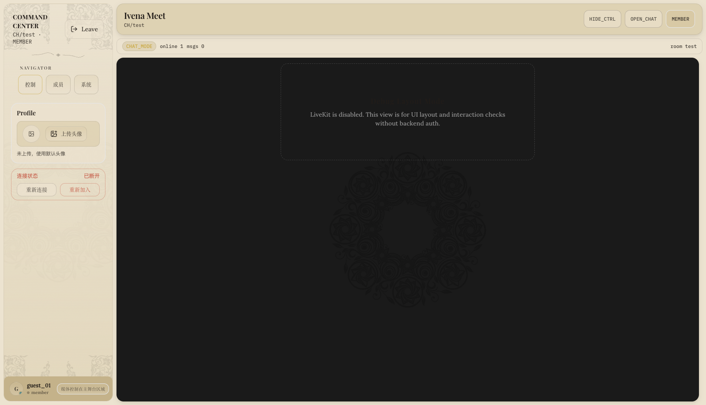
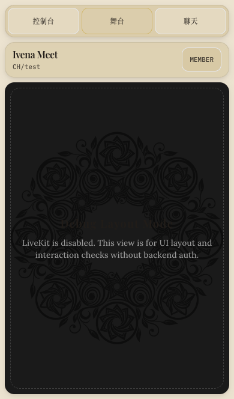
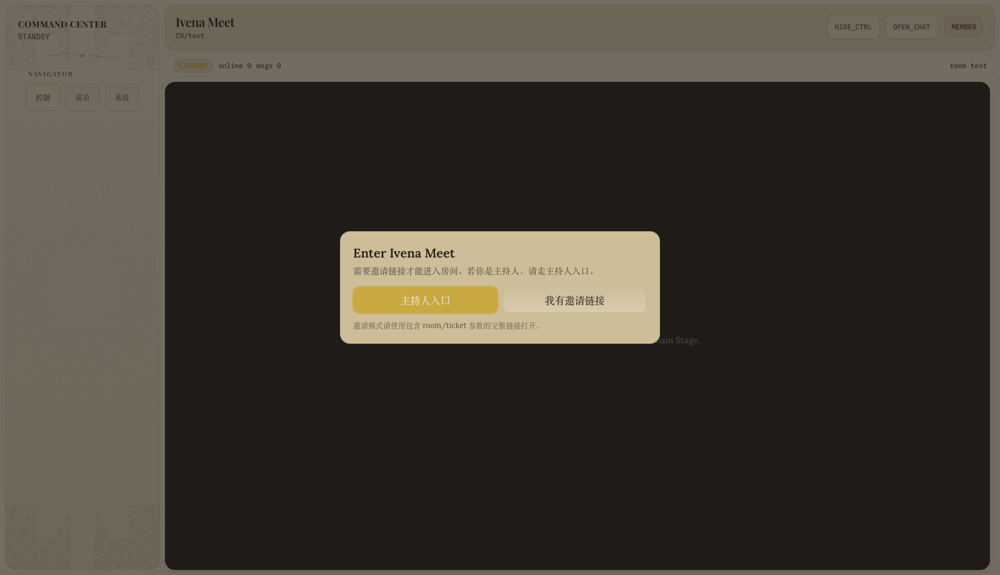
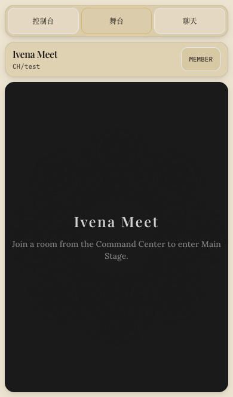
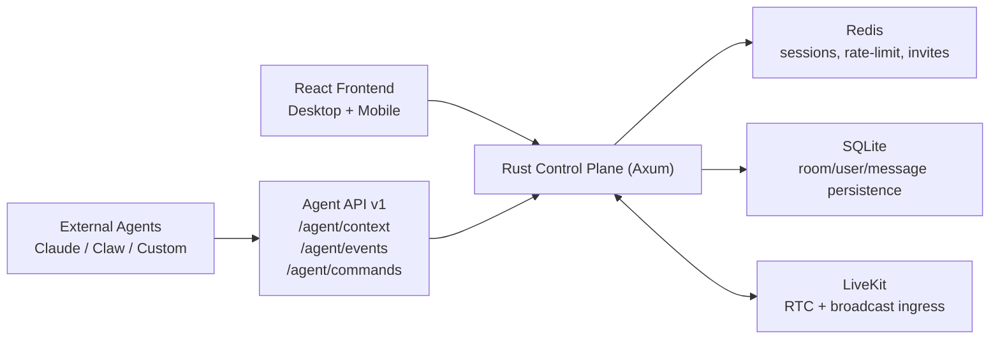

# Ivena Meet

Production-style private meeting room built on **LiveKit + Rust (Axum) + Redis + SQLite**, with a separate **agent-native API layer** for AI operators.

<p align="left">
  
  
  
  
  
</p>

## Product Preview

| Desktop | Mobile |
|---|---|
|  |  |

> Screenshot mode: `?debug=mobile` with LiveKit disabled for deterministic UI checks.

## Auth Entry Preview

| Desktop Auth Gate | Mobile Entry Gate |
|---|---|
|  |  |

> Captured from normal open flow (no auth bypass): users choose host entry or invite entry before joining.

## Why It Feels Like a Product

- **Secure room lifecycle**: invite redeem, host identity binding, one-time broadcast start token, TTL-based sessions.
- **Host control plane**: moderation, stage media permission, broadcast orchestration, invite management.
- **Chat with durability**: persisted message history + streaming sync + retry-safe write path.
- **Agent-native by design**: machine-readable `context/events/commands` contract without breaking existing APIs.
- **Operationally ready**: systemd deploy scripts, cron cleanup, env dictionary, reverse-proxy topology.

## Architecture At A Glance



## Quick Start (Local)

### 1) Start backend

```bash
cd /opt/livekit/control-plane
cp .env.example .env
make init-db
cargo run
```

### 2) Start frontend

```bash
cd /opt/livekit/control-plane/apps/frontend
cp .env.example .env
npm install
npm run dev -- --host 0.0.0.0 --port 8090
```

### 3) Debug mobile layout without backend auth

```bash
# apps/frontend/.env
VITE_DEV_AUTH_BYPASS=true
VITE_DEV_DISABLE_LIVEKIT=true
```

Then open:

- `/?debug=mobile`
- `/?debug=mobile&livekit=off`

## Core Capabilities

### Room + Session

- `POST /rooms/join` (`role=host|member`)
- `POST /host/login/totp`
- `POST /host/sessions/refresh`
- `POST /sessions/refresh`
- Session TTL + rotation + identity lock ownership checks

### Invite + Broadcast

- `POST /auth/invite`
- `POST /invites/redeem`
- `POST /broadcast/issue`
- `POST /broadcast/start`
- `POST /broadcast/stop`

### Chat + Profile

- `GET /rooms/:room_id/messages`
- `POST /rooms/:room_id/messages`
- `GET /rooms/:room_id/messages/stream`
- `POST /users/upsert`
- `POST /users/avatar/upload`

### Agent API (optional)

Enable in `.env`:

```bash
ENABLE_AGENT_API=true
```

Routes:

- `GET /agent/v1/context?room_id=<room_id>&message_limit=20`
- `GET /agent/v1/events?room_id=<room_id>&after_seq=0&limit=80`
- `POST /agent/v1/commands`

Command model:

- Low-risk commands: `refresh_session`, `send_message`, `issue_invite`
- Preferred execution: `mode=simulate|execute`
- Compatibility: legacy `dry_run` is still accepted
- Retry safety: `idempotency_key` supported

Example:

```json
{
  "room_id": "test",
  "command": "send_message",
  "mode": "execute",
  "idempotency_key": "agent-msg-00000001",
  "params": {
    "text": "hello from agent"
  }
}
```

## Security Model

- Control routes require `Authorization: Bearer <host_session_token>`:
  - `/auth/invite`
  - `/broadcast/*`
  - `/moderation/*`
- Admin token is reserved for bootstrap/management APIs.
- `broadcast/start` requires:
  - control auth
  - room active check
  - host identity binding
  - one-time `start_token`
  - rate limit
- Chat write identity is always bound to server-issued `app_session_token`.
- `x-forwarded-for` is trusted only when peer IP is in `TRUSTED_PROXY_IPS`.

Input validation defaults:

- `room_id`: `[a-zA-Z0-9_-]`, 3-64 chars
- `user_name`: `[a-zA-Z0-9_-]`, 2-32 chars
- `nickname`: 2-32 chars
- `message.text`: 1-500 chars
- `avatar_url`: optional `https://`, max 512 chars

## Deploy As Services (systemd)

Service templates:

- `deploy/systemd/ivena-meet-control-plane.service`
- `deploy/systemd/ivena-meet-frontend.service`

Install:

```bash
cd /opt/livekit/control-plane
sudo ./deploy/systemd/install.sh
```

Deploy:

```bash
/opt/livekit/control-plane/deploy/systemd/deploy.sh
```

Check status:

```bash
systemctl status ivena-meet-control-plane.service --no-pager
systemctl status ivena-meet-frontend.service --no-pager
journalctl -u ivena-meet-control-plane.service -f
journalctl -u ivena-meet-frontend.service -f
```

## Bootstrap Host (one command)

```bash
cd /opt/livekit/control-plane
BOOTSTRAP_ADMIN_TOKEN='replace-with-strong-random-token' ROOM_ID='test' HOST_IDENTITY='alice_host' make bootstrap-host
```

Need secret material (default is redacted):

```bash
BOOTSTRAP_ADMIN_TOKEN='...' ROOM_ID='test' HOST_IDENTITY='alice_host' ./scripts/bootstrap-host.sh --show-secrets
```

Notes:

- `--show-secrets` writes one-time temp files with `chmod 600`
- `CI=true` forbids `--show-secrets`
- delete temp files after setup

With MFA reset:

```bash
BOOTSTRAP_ADMIN_TOKEN='...' ROOM_ID='test' HOST_IDENTITY='alice_host' RESET_MFA=1 make bootstrap-host
```

## Reverse Proxy (recommended)

- `meet.example.com` -> `10.0.0.10:8090` (frontend)
- `meet.example.com/api` -> `10.0.0.10:3000` (control-plane)
- `livekit.example.com` -> LiveKit server (WSS)

Nginx Proxy Manager:

- Proxy A (`meet.example.com`) forwards to frontend
- Add advanced location `/api` to backend
- Proxy B (`livekit.example.com`) forwards to `:7880` with SSL + WebSocket
- Add NPM internal IP into `TRUSTED_PROXY_IPS`

## Required Env

- `APP_BIND` (default `0.0.0.0:3000`)
- `APP_ENV` (default `development`)
- `ALLOW_OPEN_JOIN_IN_PROD` (default `false`)
- `REDIS_URL` (default `redis://127.0.0.1:6379/`)
- `SQLITE_PATH` (default `/opt/livekit/control-plane/data/app.db`)
- `MEET_BASE_URL` (example `https://meet.example.com`)
- `LIVEKIT_HOST`
- `LIVEKIT_PUBLIC_WS_URL`
- `LIVEKIT_API_KEY`
- `LIVEKIT_API_SECRET`
- `BOOTSTRAP_ADMIN_TOKEN` (or legacy `ADMIN_TOKEN`)
- `RUNTIME_ADMIN_TOKEN` (or legacy `ADMIN_TOKEN`)

## Optional Env (selected)

- `ENABLE_AGENT_API` default `false`
- `REQUIRE_INVITE` default `true`
- `REQUIRE_ADMIN_FOR_JOIN` default `false`
- `BOOTSTRAP_ADMIN_TOKEN_PREVIOUS` optional dual-token rotation slot
- `RUNTIME_ADMIN_TOKEN_PREVIOUS` optional dual-token rotation slot
- `CONTROL_ADMIN_ALLOWLIST_IPS` optional IP allowlist for admin/control access
- `SESSION_TTL_SECONDS` default `1800`
- `INVITE_MAX_USES` default `10`
- `RATE_LIMIT_WINDOW_SECONDS` default `60`
- `RATE_LIMIT_ROOM_JOIN` default `20`
- `RATE_LIMIT_INVITE_REDEEM` default `12`
- `RATE_LIMIT_CHAT_MESSAGE` default `30`
- `TRUSTED_PROXY_IPS` default empty

Full dictionary: `docs/config-dictionary.md`

Admin token rotation runbook: `docs/admin-token-ops.md`

Quick rotate command:

```bash
cd /opt/livekit/control-plane
NEW_TOKEN='<new-random-token>' make rotate-admin-token
```

## Operational Hardening

### Avatar pipeline

- Upload cap: 2MB
- Format whitelist: png/jpg/webp (magic-byte check)
- Server transcode to `256x256 .webp`
- Limits: 2/minute + 100/day + storage quota

Nightly cleanup:

```bash
cd /opt/livekit/control-plane
make cleanup-orphan-avatars
```

Install cron:

```bash
mkdir -p /opt/livekit/control-plane/logs
(crontab -l 2>/dev/null; cat /opt/livekit/control-plane/deploy/cron/cleanup-orphan-avatars.cron) | crontab -
```

### Echo-safe host setup

- Host microphone: browser LiveKit mic
- Content audio: OBS WHIP ingress (`host__ingress`)
- Browser screen share is video-only
- Do not add microphone source in OBS when browser mic is already active

### OBS/WHIP troubleshooting

- Symptom: OBS `PeerConnection state: Connecting` then timeout (~30-45s)
- First check: disable VPN/TUN/global proxy for OBS machine
- Required network:
  - UDP `7885` ingress ICE
  - UDP `7882` LiveKit RTC
  - UDP `3478` TURN
  - Optional TCP fallback `7886` / `7881`

## End-to-End Flow (Invite + Secure Start)

1. Bootstrap host (`make bootstrap-host`)
2. Host login (`/host/login/totp`) -> `host_session_token`
3. Host join (`/rooms/join role=host`)
4. Issue invite (`/auth/invite`)
5. Member redeem (`/invites/redeem`)
6. Member join (`/rooms/join` with `redeem_token`)
7. Issue broadcast token (`/broadcast/issue`)
8. Start broadcast (`/broadcast/start`)

## Minimal cURL Flow

```bash
# 1) bootstrap once (admin)
BOOTSTRAP_ADMIN_TOKEN='replace-with-strong-random-token' ROOM_ID='test' HOST_IDENTITY='host-1' make bootstrap-host

# 2) host login with TOTP
curl -sS -X POST http://127.0.0.1:3000/host/login/totp \
  -H 'content-type: application/json' \
  -d '{"room_id":"test","host_identity":"host-1","totp_code":"123456"}'

# 3) host join with host_session_token
curl -sS -X POST http://127.0.0.1:3000/rooms/join \
  -H "authorization: Bearer <host_session_token>" \
  -H 'content-type: application/json' \
  -d '{"room_id":"test","user_name":"host-1","role":"host"}'

# 4) issue invite
curl -sS -X POST http://127.0.0.1:3000/auth/invite \
  -H "authorization: Bearer <host_session_token>" \
  -H 'content-type: application/json' \
  -d '{"room_id":"test","host_identity":"host-1"}'

# 5) redeem invite
curl -sS -X POST http://127.0.0.1:3000/invites/redeem \
  -H 'content-type: application/json' \
  -d '{"room_id":"test","user_name":"alice","invite_ticket":"<ticket>","invite_code":"<code>"}'

# 6) member join with redeem_token
curl -sS -X POST http://127.0.0.1:3000/rooms/join \
  -H 'content-type: application/json' \
  -d '{"room_id":"test","user_name":"alice","role":"member","redeem_token":"<redeem_token>"}'

# 7) write chat message with app_session_token from join response
curl -sS -X POST http://127.0.0.1:3000/rooms/test/messages \
  -H "authorization: Bearer <app_session_token>" \
  -H 'content-type: application/json' \
  -d '{"text":"hello"}'

# 8) refresh app_session_token before expiry
curl -sS -X POST http://127.0.0.1:3000/sessions/refresh \
  -H "authorization: Bearer <app_session_token>" \
  -H 'content-type: application/json' \
  -d '{}'

# 9) issue short broadcast start token
curl -sS -X POST http://127.0.0.1:3000/broadcast/issue \
  -H "authorization: Bearer <host_session_token>" \
  -H 'content-type: application/json' \
  -d '{"room_id":"test","host_identity":"host-1"}'

# 10) start broadcast with one-time token
curl -sS -X POST http://127.0.0.1:3000/broadcast/start \
  -H "authorization: Bearer <host_session_token>" \
  -H 'content-type: application/json' \
  -d '{"room_id":"test","participant_identity":"host-1","start_token":"<start_token>"}'
```

## Repo Layout

```txt
.
├── src/                     # Rust control-plane
├── apps/
│   └── frontend/            # React + Vite frontend
├── docs/                    # design/config docs
├── skills/                  # agent integration skills
└── .github/workflows/ci.yml
```
